<div align="center">

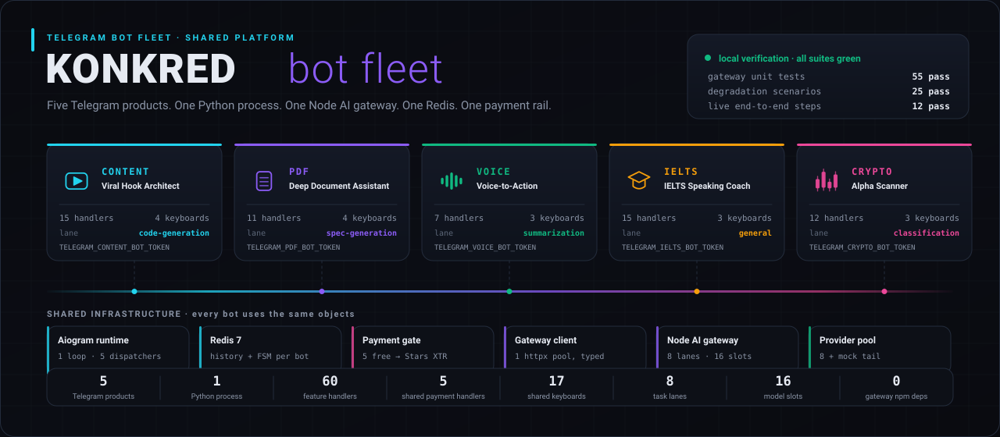

</div>

**Konkred is not five scripts. It is one platform that happens to expose five Telegram products.**
One Python process runs every bot, one Redis holds every conversation and every state machine,
one payment gate counts every free action, and one Node.js gateway decides which model answers.
Adding a sixth product means adding a router and a token — not another deployment.

<table>
<tr>
<td width="20%" valign="top"><b>Products</b><br>Content · PDF · Voice · IELTS · Crypto</td>
<td width="20%" valign="top"><b>Runtime</b><br>Python 3.11 · Aiogram 3.15<br>one asyncio loop</td>
<td width="20%" valign="top"><b>State</b><br>Redis 7 · history + FSM<br>namespaced per bot</td>
<td width="20%" valign="top"><b>Inference</b><br>Node 20 ESM gateway<br>8 providers · 16 model slots</td>
<td width="20%" valign="top"><b>Verification</b><br>55 + 25 + 12 checks<br>run locally, listed below</td>
</tr>
</table>

**Jump to** &nbsp;
[The fleet](#the-fleet) ·
[Five products](#five-products) ·
[Shared runtime](#shared-runtime) ·
[Isolation](#handler-and-keyboard-isolation) ·
[Memory & FSM](#shared-memory-and-fsm) ·
[Payments](#payments) ·
[Gateway](#gateway-routing) ·
[Providers](#provider-fallback) ·
[Degradation](#degradation-handling) ·
[Webhooks](#webhooks) ·
[Docker](#docker) ·
[CI & testing](#ci-and-testing) ·
[Deployment](#deployment)

---

# The fleet

Every Telegram product in this repository is an Aiogram `Router` plus a keyboard module. Nothing
else. The parts that are hard to get right — memory, state, payments, retries, quota accounting,
model selection, graceful failure — live once, in shared modules, and every product inherits them.

| Layer | What it is | Where it lives |
|---|---|---|
| Products | 5 routers, 60 feature handlers, 17 inline keyboards | `bots/bot_*/` |
| Shared services | config · history · payments · gateway client · utils | `bots/shared/` |
| Orchestrator | builds one `Bot` + `Dispatcher` per configured token | `bots/main.py` |
| State | Redis 7 — conversation windows, FSM data, payment ledger | `docker-compose.yml` |
| Inference | quota-aware multi-provider gateway, zero npm dependencies | `gateway/` |

A product starts only when its token is set. `get_active_bots()` filters `BOT_SPECS` on a
non-empty token, so running one bot or all five is the same command and the same image.

### Fleet command surface

Every product exposes `/help`, `/clear` and `/paysupport`; the rest is product-specific. `/clear`
wipes only that product's conversation window, and `/paysupport` is served by the shared payment
router rather than by any individual bot.

| Command | Content | PDF | Voice | IELTS | Crypto | Served by |
|---|:--:|:--:|:--:|:--:|:--:|---|
| `/start` | ✅ | ✅ | ✅ | ✅ | ✅ | product router |
| `/help` | ✅ | ✅ | ✅ | ✅ | ✅ | product router |
| `/clear` | ✅ | ✅ | ✅ | ✅ | ✅ | product router → `HistoryManager` |
| `/paysupport` | ✅ | ✅ | ✅ | ✅ | ✅ | **shared** payment router |
| `/create` · `/formulas` · `/cancel` | ✅ | — | — | — | — | content FSM |
| `/test` · `/bands` · `/stop` | — | — | — | ✅ | — | IELTS FSM |
| `/scan` · `/sentiment` · `/news` | — | — | — | — | ✅ | crypto commands |
| `/verify <txid>` | ✅ | ✅ | ✅ | ✅ | ✅ | **shared** payment router (USDT path, off by default) |

### Capability matrix

| Capability | Content | PDF | Voice | IELTS | Crypto |
|---|:--:|:--:|:--:|:--:|:--:|
| Accepts audio uploads | — | — | ✅ | ✅ | — |
| Accepts document uploads | — | ✅ | — | — | — |
| Finite state machine | ✅ 3 | — | — | ✅ 3 | — |
| Structured output validated before rendering | — | ✅ quiz | — | ✅ bands | — |
| Multi-model fusion | — | — | — | — | ✅ scans |
| Mandatory disclaimer on every reply | — | — | — | — | ✅ |
| Gateway task lane | `code-generation` | `spec-generation` | `summarization` | `general` + `summarization` | `classification` |

### Inline keyboard inventory

Seventeen keyboards, all built from plain `InlineKeyboardMarkup` with a per-product callback
prefix — no keyboard module imports another product's prefix.

| Product | Prefix | Keyboards |
|---|---|---|
| Content | `content:` | main menu · platform picker · tone picker · result actions |
| PDF | `pdf:` | document actions · quiz answers · next question · finish |
| Voice | `voice:` | main menu · result actions · retry |
| IELTS | `ielts:` | main menu · exam controls · evaluation menu |
| Crypto | `crypto:` | main menu · report menu · news menu |

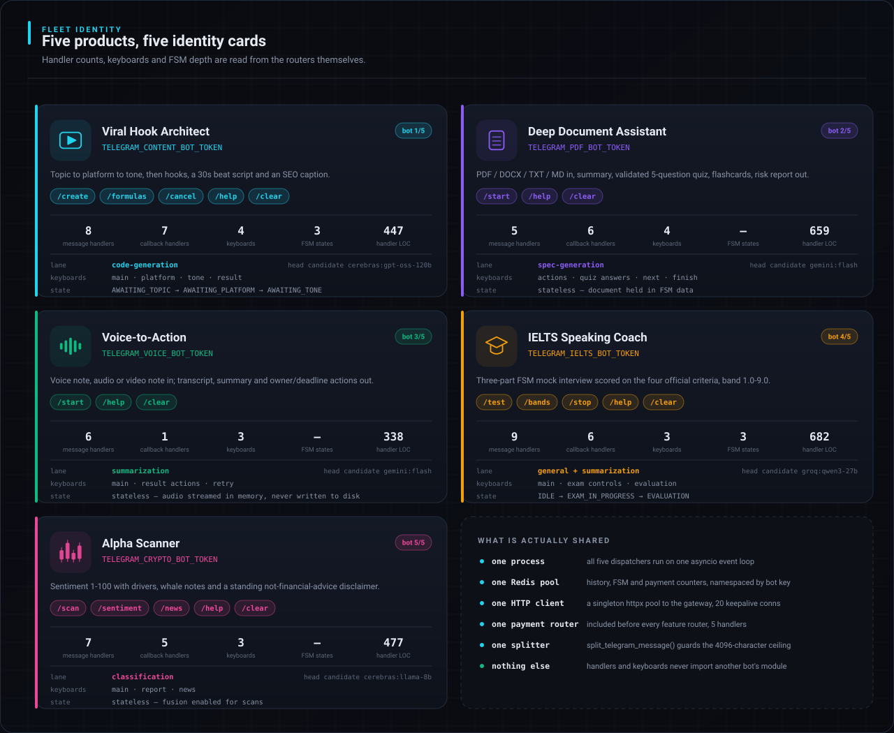

# Five products

### Viral Hook Architect — `TELEGRAM_CONTENT_BOT_TOKEN`

A three-step FSM: topic → platform → tone. Returns three hooks, a beat-by-beat 30-second script
with timestamps, and an SEO caption. Follow-up buttons regenerate, produce more hooks, a shot list
or a 7-day series.

```
/create → AWAITING_TOPIC → AWAITING_PLATFORM → AWAITING_TONE → gateway(code-generation)
          topic text        Reels/TikTok/Shorts   4 tones        3 hooks + 30s beat script + SEO caption
                                                                 ↳ regenerate · more hooks · shot list · 7-day series
```

`/create` `/formulas` `/cancel` `/help` `/clear` `/paysupport` — 8 message handlers, 7 callback
handlers, 4 keyboards, 3 FSM states, routed on the `code-generation` lane.

### Deep Document Assistant — `TELEGRAM_PDF_BOT_TOKEN`

Accepts PDF, DOCX, TXT and MD. Inline buttons produce an executive summary, a **validated**
five-question quiz (option counts, answer indices and types are checked field by field before a
keyboard is built), flashcards, a contract-risk analysis, key terms or a figures extract.

```
document upload → extract text (pypdf · python-docx · plain) → FSM data
                → summary | quiz | flashcards | risk | key terms | figures
                  quiz → validate options/indices → answer buttons → score → next question
```

`/start` `/help` `/clear` `/paysupport` — 5 message handlers, 6 callback handlers, 4 keyboards,
routed on the `spec-generation` lane, whose chain leads with Gemini Flash and its 1M context.

### Voice-to-Action — `TELEGRAM_VOICE_BOT_TOKEN`

Send a voice note, an audio file or a video note. Returns a cleaned transcription, a structured
summary, and an `[ACTION]` / `[DECISION]` / `[QUESTION]` list with owners and deadlines. Audio is
streamed into memory and never written to disk. Result buttons re-cut the same audio into action
items only, a draft reply, an English translation or formal minutes.

```
voice note / audio / video note → download to memory → inline audio part → gateway(summarization)
                                → transcript + summary + [ACTION]/[DECISION]/[QUESTION] list
                                  ↳ action items only · draft reply · translate · minutes
```

`/start` `/help` `/clear` `/paysupport` — 6 message handlers, 1 callback handler, 3 keyboards,
routed on the `summarization` lane.

### IELTS Speaking Coach — `TELEGRAM_IELTS_BOT_TOKEN`

A full three-part mock interview driven by `UserPhase` (`IDLE → EXAM_IN_PROGRESS → EVALUATION`).
Scores the four official criteria — Fluency & Coherence, Lexical Resource, Grammatical Range &
Accuracy, Pronunciation — and returns a band from 1.0 to 9.0, then offers improvement notes and
model answers. Answers may be typed or spoken.

```
/test → EXAM_IN_PROGRESS  part 1 (7 questions) → part 2 (long turn) → part 3 (discussion)
      → EVALUATION        four criteria scored → band 1.0-9.0 → improvement notes · model answers
```

`/test` `/bands` `/stop` `/help` `/clear` `/paysupport` — 9 message handlers, 6 callback handlers,
3 keyboards, 3 FSM states, routed on `general` with `summarization` for spoken answers.

### Alpha Scanner — `TELEGRAM_CRYPTO_BOT_TOKEN`

Market sentiment scored 1–100 with the drivers behind it, whale-activity notes and an explicit
risk warning. Report buttons produce a bull-vs-bear debate, a risk checklist or a plain-language
explanation. Multi-model fusion is enabled for scans, and every reply carries a *not financial
advice* disclaimer.

```
/scan BTC → gateway(classification, fusion=true) → sentiment 1-100 + drivers + whale notes + risk
          → bull vs bear · risk checklist · explain simply · rescan        (disclaimer appended)
```

`/scan <ticker>` `/sentiment <topic>` `/news` `/help` `/clear` `/paysupport` — 7 message handlers,
5 callback handlers, 3 keyboards, routed on the `classification` lane.

> [!TIP]
> Gemini is the only configured provider with native audio and document understanding. The voice
> and document products give their best results with at least one `GEMINI_KEY_*` present; without
> one they still answer, further down their candidate chain.

# Shared runtime

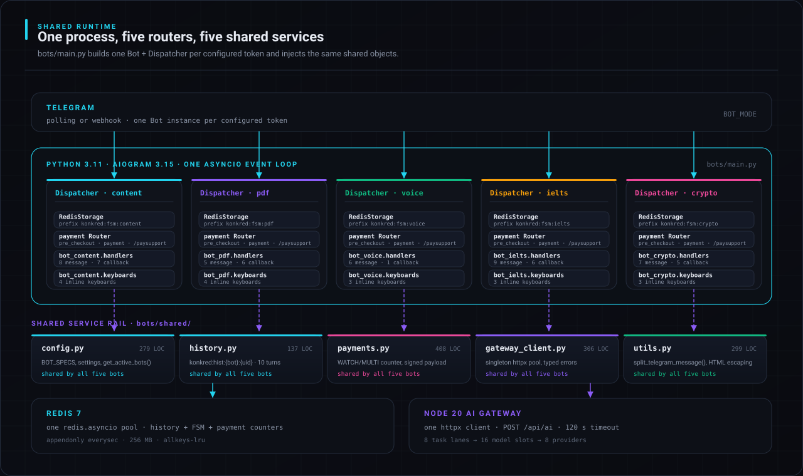

`bots/main.py` is the whole orchestrator. For each configured token it builds a `Bot`, a
`Dispatcher` with a `RedisStorage` whose key prefix is namespaced to that product, includes the
payment router and then the feature router, and injects the per-bot dependencies through
dispatcher workflow data:

```python
dispatcher["history"]  = HistoryManager(redis_client, spec.history_prefix)
dispatcher["payments"] = PaymentManager(redis_client, spec)
dispatcher["bot_spec"] = spec
```

One `redis.asyncio.Redis` pool and one `httpx.AsyncClient` serve all five products. Shutdown is
single-owner: one `SIGINT`/`SIGTERM` handler stops the pollers or drains in-flight webhook tasks,
closes each Telegram session and the gateway client, then releases the Redis pool.

| Shared module | Responsibility | Used by |
|---|---|---|
| `shared/config.py` | `.env` loading, typed settings, `BOT_SPECS`, `get_active_bots()` | all five |
| `shared/history.py` | sliding-window conversation memory, 10 turns, 24 h TTL | all five |
| `shared/payments.py` | free-action counter, Stars invoices, entitlements, optional USDT | all five |
| `shared/gateway_client.py` | singleton HTTP pool to the gateway, typed `GatewayError`, retry policy | all five |
| `shared/utils.py` | `split_telegram_message()`, HTML escaping, formatting helpers | all five |

### Startup sequence

```
validate_settings()           refuses to boot on an impossible configuration
  └── Redis PING              one pool, shared by every product
      └── for each active bot in BOT_SPECS
            build Bot + Dispatcher + RedisStorage(prefix=konkred:fsm:{key})
            include payment router, then the product router
            inject history · payments · bot_spec
            get_me()          a bad token disables that product, never the process
            set_my_commands() the per-product Telegram menu
      └── BOT_MODE=webhook → register one secret URL per bot, serve $PORT
          BOT_MODE=polling → start N concurrent pollers, serve /healthz
```

A product whose token fails authentication is logged and skipped; the rest of the fleet keeps
running. One product crashing its poller does not stop the others — each poller is supervised
independently.

### Adding a sixth product

1. Add a `BotSpec` to `BOT_SPECS` in `shared/config.py` (key, token env, title, router path,
   history prefix).
2. Create `bots/bot_<key>/handlers.py` with a `router` and `bots/bot_<key>/keyboards.py` with its
   own `CB_PREFIX`.
3. Register it in `ROUTERS` and `COMMANDS` in `main.py`.
4. Pick a gateway task lane — or add one to `TASK_ROUTES` if no existing chain fits.
5. Set its token. Memory, FSM, payments, retries, fallback, webhooks and Docker are already done.

### Why one process

Five separate services would mean five Redis clients, five HTTP pools, five payment
implementations, five deployment targets and five places to fix the same bug. One process means a
single event loop scheduling all Telegram I/O, one connection pool per backend, and one place
where memory, money and failure are handled. The cost of that choice is isolation discipline —
which is why dispatchers, storages, callback prefixes and history namespaces are strictly
per-product, and why the degradation suite drives all five products through the same failures.

### The fleet in numbers

| Product | Message handlers | Callback handlers | Keyboards | FSM states | Handler LOC | Lane |
|---|:--:|:--:|:--:|:--:|:--:|---|
| Content | 8 | 7 | 4 | 3 | 447 | `code-generation` |
| PDF | 5 | 6 | 4 | — | 659 | `spec-generation` |
| Voice | 6 | 1 | 3 | — | 338 | `summarization` |
| IELTS | 9 | 6 | 3 | 3 | 682 | `general` + `summarization` |
| Crypto | 7 | 5 | 3 | — | 477 | `classification` |
| **Fleet** | **35** | **25** | **17** | **6** | **2 603** | 5 of 8 lanes |

Plus the shared payment router — 3 message handlers, 1 callback handler and 1
`pre_checkout_query` handler — included once per dispatcher, so it is written once and observed
five times.

### What a user sees when inference fails

| Failure | What the product does |
|---|---|
| Gateway unreachable or `503` | a plain "try again shortly" reply, history untouched |
| `429` from the gateway | the typed `retry_after` becomes a human wait hint |
| `401` (bad gateway credential) | a generic apology — the credential problem never reaches the user |
| `413` payload too large | a size-specific message naming the limit, not a traceback |
| Unexpected exception | the handler catches, logs and answers; the status message is always resolved |

No path leaves a "working on it…" placeholder as the last message, and no path prints a
traceback, a URL or a provider name into the chat. All 25 combinations are asserted.

### One message, end to end

```
1  Telegram update              →  the dispatcher for that product only
2  payment router               →  pre-checkout / successful-payment events short-circuit here
3  handler                      →  parses the command, uploads or callback data
4  payments.require(user)       →  WATCH/MULTI reserve, or send the Stars invoice and stop
5  history.get(user)            →  last 10 turns from konkred:hist:{bot}:{user}
6  gateway_client.ask(...)      →  POST /api/ai with the product's task lane
7  gateway                      →  cache → dedup → route → admit → dispatch → classify
8  history.append(user, reply)  →  window trimmed, TTL refreshed
9  split_telegram_message()     →  HTML-escaped chunks under 4096 characters
```

Steps 1-5, 8 and 9 are identical for all five products. Only steps 3 and 6 are product code —
which is why a new product is a router, not a new service.

### Fleet health surface

The Python side exposes two endpoints of its own, independent of the gateway:

```
GET /         {"service":"konkred-bots","status":"ok","mode":"polling","bots":["crypto","pdf",…]}
GET /healthz  {"status":"ok","mode":"webhook","activeBots":3,"pendingUpdates":0}
```

`activeBots` counts the products that actually authenticated with Telegram, and `pendingUpdates`
is the number of webhook dispatches still in flight — the same set the shutdown path drains. The
health probe deliberately does not `PING` Redis on every call: startup already proved the pool,
and a hosted platform probing every few seconds should not pay for a round trip each time.

### Configuration that shapes the fleet

| Variable | Default | Effect on the fleet |
|---|---|---|
| `TELEGRAM_*_BOT_TOKEN` | — | presence decides which of the five products start |
| `BOT_MODE` | `polling` | transport for every product at once |
| `REDIS_URL` | `redis://127.0.0.1:6379/0` | the one pool behind history, FSM and payments |
| `HISTORY_TURNS` / `HISTORY_TTL` | `10` / `86400` | conversation window depth and lifetime |
| `FREE_REQUESTS` | `5` | free AI actions per user **per product** |
| `STARS_PRICE` / `PAID_ACCESS_DAYS` | `100` / `30` | the Stars offer every product shows |
| `PAYMENTS_ENABLED` | `true` | one switch disables the gate fleet-wide |
| `MAX_FILE_MB` | `20` | upload ceiling for the document and voice products |
| `GATEWAY_URL` / `GATEWAY_API_KEY` | `http://127.0.0.1:3000` / — | where the fleet sends inference |

`.env.example` documents every variable, including the gateway-side knobs, and the `env-contract`
test fails if it drifts from what the code actually reads.

# Handler and keyboard isolation

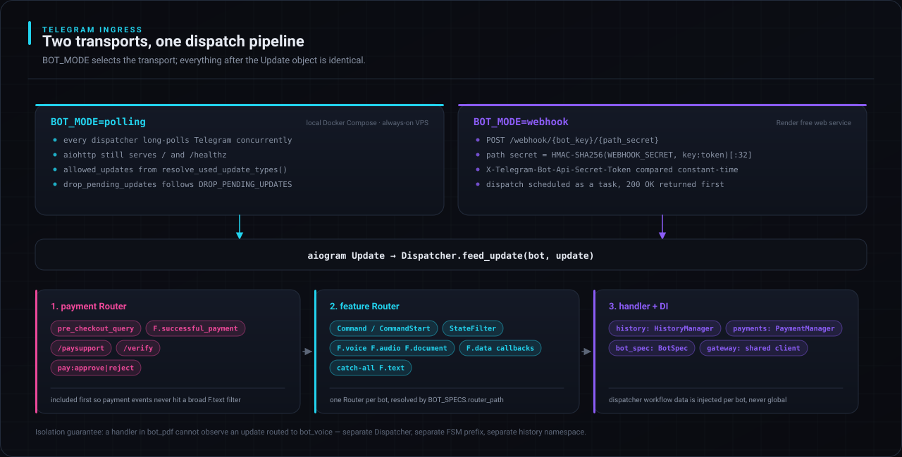

Sharing infrastructure is not the same as sharing behaviour. The products are deliberately
isolated from each other:

- **Separate dispatchers.** An update fed to the PDF dispatcher can never be observed by a voice
  handler — they are different `Dispatcher` objects with different storages.
- **Separate callback namespaces.** Each keyboard module owns a `CB_PREFIX`, so callback data
  cannot collide across products even inside the same Telegram account.
- **Payment first.** `create_payment_router()` returns a *fresh* router per dispatcher and is
  included before the feature router, so `pre_checkout_query` and `successful_payment` are never
  swallowed by a broad `F.text` catch-all.
- **No cross-imports.** No `bot_*` module imports another `bot_*` module; the only shared imports
  are `shared/`.
- **Bounded output.** Every reply passes through `split_telegram_message()`, which respects
  Telegram's 4096-character ceiling by splitting on paragraph breaks first, then line breaks, then
  spaces, and only hard-slicing a genuinely unbreakable run.
- **Untrusted model output.** Text is HTML-escaped before it reaches Telegram, and structured
  output is validated field by field before it is rendered into a keyboard.

| Isolated per product | Shared across the fleet |
|---|---|
| `Dispatcher`, FSM storage prefix, callback prefix | the asyncio event loop and the process |
| conversation history namespace | the Redis connection pool |
| free-action counter and entitlement key | the `PaymentManager` implementation and its router |
| handler and keyboard modules | the gateway HTTP client and its retry policy |
| Telegram command menu | `split_telegram_message()` and the formatting helpers |

# Shared memory and FSM

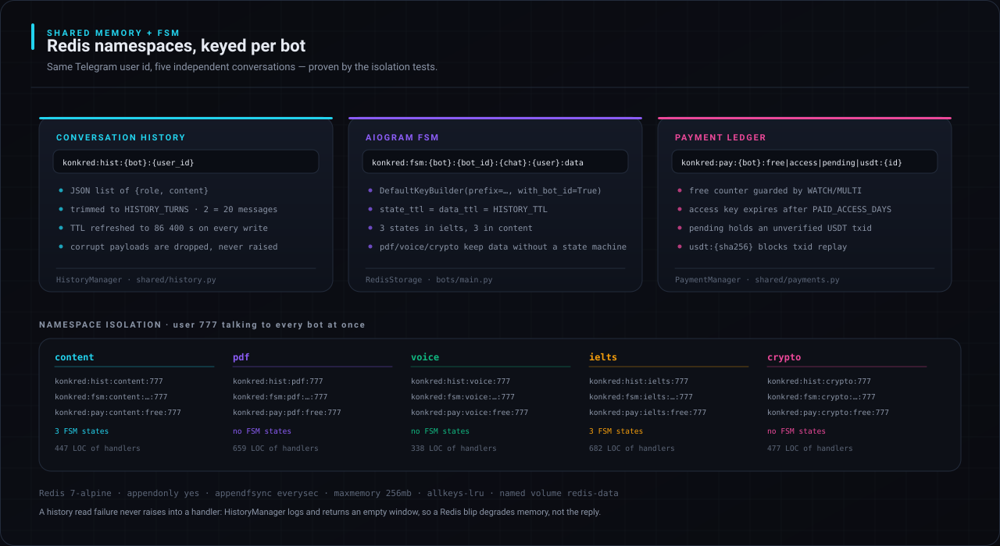

Three namespaces, all keyed by product:

```
konkred:hist:{bot}:{user_id}                      conversation window · JSON · 24 h TTL
konkred:fsm:{bot}:{bot_id}:{chat}:{user}:data     aiogram FSM state and data
konkred:pay:{bot}:free|access|pending:{user_id}   free counter, entitlement, pending USDT
```

The same Telegram user talking to all five bots keeps five independent conversations, five
independent state machines and five independent free-action counters. Redis failures degrade
memory rather than the product: `HistoryManager` logs the error and returns an empty window
instead of raising into a handler.

`HistoryManager` stores the window as one JSON document per user per product, trims it to
`HISTORY_TURNS · 2` messages on every write, refreshes the 24-hour TTL at the same time, and
discards a corrupt payload rather than propagating a decode error. Idle conversations therefore
expire on their own — there is no cleanup job to run and no unbounded key growth. Aiogram's FSM
uses `DefaultKeyBuilder(prefix="konkred:fsm:{key}", with_bot_id=True)`, so even two products
sharing one Telegram account cannot collide.

# Payments

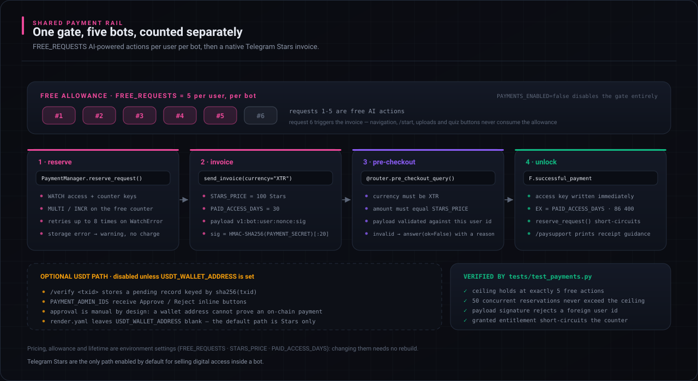

The first `FREE_REQUESTS` (default **5**) AI-powered actions per user **per bot** are free.
Navigation, `/start`, help, uploading a document and quiz answer buttons do not consume the
allowance — only calls that reach the gateway do.

The counter is reserved with Redis `WATCH`/`MULTI` and retried up to eight times on contention, so
concurrent messages cannot push a user past the ceiling. Request six sends a native **Telegram
Stars (`XTR`)** invoice: the default offer is `STARS_PRICE=100` Stars for `PAID_ACCESS_DAYS=30`.
The invoice payload is `v1:{bot}:{user}:{nonce}:{hmac}`, signed with `PAYMENT_SECRET` and bound to
that user id; `pre_checkout_query` re-validates the currency, the amount and the signature before
Telegram is allowed to charge anyone.

> [!CAUTION]
> An optional USDT path exists behind `USDT_WALLET_ADDRESS` with manual admin approval, and is
> **off by default** — `render.yaml` ships that variable blank. Telegram's terms require digital
> goods sold inside bots to use Stars, and a wallet address alone cannot prove an on-chain
> payment. Enable it only with your own platform and legal guidance.

| Action | Consumes an allowance? |
|---|---|
| `/start`, `/help`, `/clear`, menu navigation | no |
| uploading a document or choosing a platform/tone | no |
| answering a quiz question | no |
| any call that reaches `POST /api/ai` | **yes** |
| a follow-up button that re-asks the model (regenerate, minutes, debate) | **yes** |

Setting `PAYMENTS_ENABLED=false` disables the gate entirely. All pricing values are environment
settings, so changing them does not require a rebuild. `tests/test_payments.py` asserts the
ceiling holds at exactly five, that 50 concurrent reservations never cross it, that a payload
signed for one user is rejected for another, and that a granted entitlement short-circuits the
counter.

---

# Technical architecture

## Gateway routing

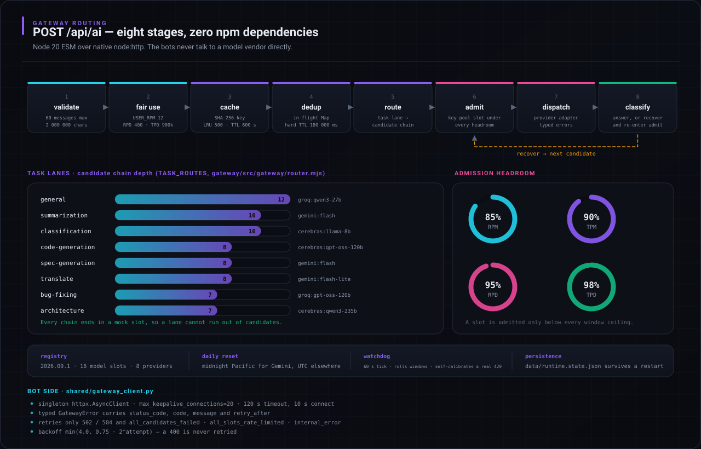

The gateway is Node 20 ESM on native `node:http` with **zero runtime dependencies** — the image
build fails if `package.json` ever grows one. A request walks eight stages: validate, per-user
fair use, cache, in-flight dedup, route, slot admission, dispatch, classify. A classified failure
re-enters slot admission with the next candidate rather than returning an error.

| Surface | Method | Purpose |
|---|---|---|
| `/api/ai` | `POST` | run a completion |
| `/api/health` | `GET` | liveness, ready slots, cache and dedup statistics |
| `/api/models` | `GET` | every model slot, task type and live availability |
| `/api/meta` | `GET` | registry version, provider summary, effective config |
| `/api/admin/dashboard` | `GET` | HTML ops console (`x-admin-key`) |
| `/api/admin/stats` | `GET` | JSON slot telemetry (`x-admin-key`) |
| `/api/admin/reset` | `POST` | clear caches, benches and cooldowns (`x-admin-key`) |

```jsonc
// POST /api/ai
{
  "taskType": "summarization",   // 8 lanes; also accepted as task_type / task
  "messages": [{ "role": "user", "content": "..." }],
  "temperature": 0.3,            // 0-2        "maxTokens": 2048,   // 1-65536
  "model": "groq:qwen3-27b",     // optional pin
  "jsonMode": false, "fusion": false, "privacy": false,
  "userId": "telegram:12345"     // per-user fair-use accounting
}
```

A success carries `requestId`, `text`, `model`, `provider`, `upstreamModel`, `finishReason`,
`usage`, `cached`, `latencyMs` and an `attempts` array describing every slot tried. Errors are
always shaped `{"error": {"code", "message", ...}}`:

| Status | Codes |
|---|---|
| `400` | `invalid_request`, `invalid_json` |
| `401` | `unauthorized` |
| `413` | `payload_too_large` |
| `429` | `user_rpm`, `user_rpd`, `user_tpd` |
| `429` / `503` | `all_slots_rate_limited`, `all_candidates_failed` |
| `500` | `internal_error` |

Admission never uses the raw published ceiling: RPM stops at 85%, TPM at 90%, RPD at 95% and TPD
at 98%, with timezone-aware daily resets (midnight Pacific for Gemini, UTC for everyone else). The
watchdog rolls windows every 60 seconds, releases expired cooldowns, calibrates a ceiling downward
when a provider returns `429` earlier than the registry predicted, and persists counters to
`gateway/data/runtime.state.json` so a restart does not reset the day.

The bot side is deliberately thin: one `httpx.AsyncClient` (20 keepalive connections, 120 s
timeout), a typed `GatewayError` carrying `status_code`, `code`, `message` and `retry_after`, and
a retry policy that only retries `502`/`504` and the codes `all_candidates_failed`,
`all_slots_rate_limited` and `internal_error`. A `400` is never retried.

### Cache, dedup, fusion and fair use

| Component | Behaviour |
|---|---|
| Cache | SHA-256 over `{taskType, messages, model, temperature, maxTokens, privacy}`; LRU of 500 entries, 600 s TTL; `privacy: true` never caches |
| Dedup | identical in-flight requests collapse into one upstream call, hard TTL 180 000 ms, timers `unref()`ed so they never hold the loop open |
| Fusion | optional multi-model consensus for a single answer; enabled by the crypto product for scans |
| Fair use | per-user RPM / RPD / TPD keyed by Telegram user id, so one user cannot drain a shared free tier; tiers and overrides via `USERS_JSON` |

### Security posture

- `ADMIN_KEY` is compared with `crypto.timingSafeEqual`; unset disables `/api/admin/*` entirely
  rather than leaving it open.
- The gateway is not meant to be public: Compose binds it to `127.0.0.1`, and the hosted image
  keeps Node on loopback while only Python binds the platform port. Set `GATEWAY_API_KEY` if you
  ever expose it.
- Requests are bounded at 60 messages and 2 000 000 characters; uploads are bounded by
  `MAX_FILE_MB`; audio and documents are processed in memory and never persisted.
- Containers run unprivileged (`node`, `konkred`) with `tini` as PID 1, so `SIGTERM` reaches the
  application and shutdown is graceful rather than a kill.

## Provider fallback

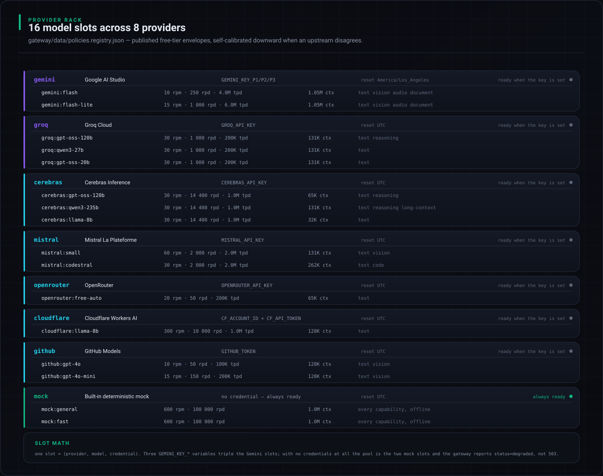

`gateway/data/policies.registry.json` (version `2026.09.1`) encodes 16 model slots across 8
providers with their published free-tier envelopes, context windows and capability flags. Each
task lane is a ranked candidate chain, 7 to 12 models deep, and **every chain ends in a local mock
slot** — a lane cannot run out of candidates.

One slot is a `(provider, model, credential)` triple, so three `GEMINI_KEY_*` variables triple the
Gemini slots. Requests are sized in tokens and validated against a model's context window *before*
a slot is assigned, so an oversized prompt is never dispatched to a model that cannot hold it.

> [!IMPORTANT]
> Model ids drift. An upstream that answers "this model has been decommissioned" is classified
> `model_unavailable`, the model is benched for 24 hours, and the request continues to the next
> candidate instead of failing. The log line names the registry entry to update.

## Degradation handling

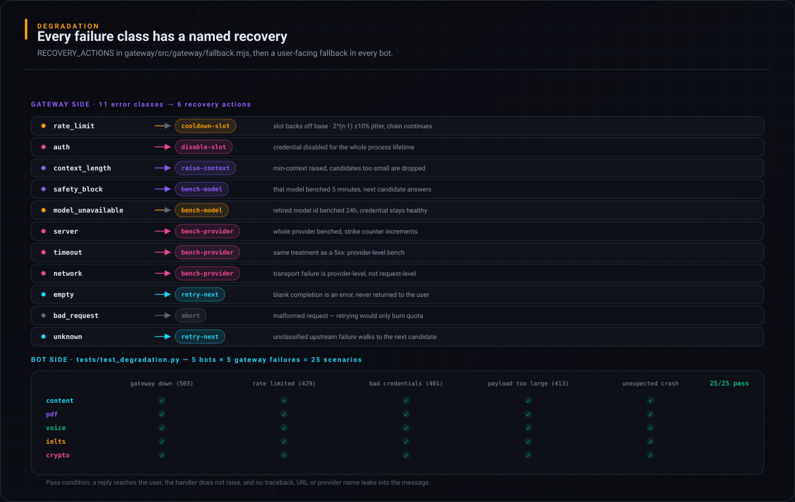

Eleven error classes map to six recovery actions in `RECOVERY_ACTIONS`. An empty completion is
treated as an error, not an answer: `SAFETY`, `RECITATION`, `BLOCKLIST` and `content_filter`
finish reasons raise a typed error so the chain continues instead of handing back a blank message.

On the product side, `tests/test_degradation.py` drives every bot through five gateway failures —
`503`, `429`, `401`, `413` and an unexpected exception. All 25 combinations must produce a real
reply, with no raised handler and no traceback, URL or provider name leaking into the message.

## Webhooks

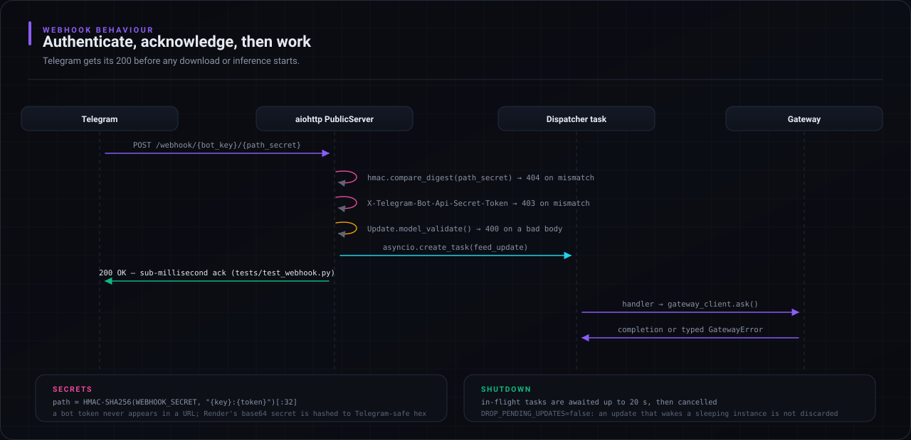

In `BOT_MODE=webhook`, aiohttp serves `POST /webhook/{bot_key}/{path_secret}`. The path segment is
`HMAC-SHA256(WEBHOOK_SECRET, "{key}:{token}")[:32]`, compared with `hmac.compare_digest` — a bot
token never appears in a URL. Telegram's `X-Telegram-Bot-Api-Secret-Token` header must also match,
and Render's generated base64 secret is hashed to Telegram-safe hexadecimal before registration.

A valid update is scheduled as a background task and Telegram receives `200 OK` immediately
(measured at 0.6–0.9 ms in `tests/test_webhook.py`), so downloads and inference never block the
acknowledgement. `DROP_PENDING_UPDATES=false` is intentional: the update that wakes a sleeping
free instance must not be discarded.

In `BOT_MODE=polling`, every dispatcher long-polls concurrently and the same aiohttp app serves
only `/` and `/healthz`.

## Operations and troubleshooting

`docker compose logs -f gateway` prints one JSON object per request — id, task, chosen slot,
attempt chain, latency. With `ADMIN_KEY` set, `/api/admin/dashboard` shows live slot health.

| Symptom | Cause and fix |
|---|---|
| Health reports `degraded` | Only the mock provider is ready — add a provider key, restart the gateway. |
| A bot never answers | Its token is unset; in webhook mode check for `webhook registered`. |
| `429 user_rpm` | Per-user fair use, not a provider limit — raise `USER_RPM` or grant a tier. |
| Stars paid but access locked | Check Redis, and that `PAYMENT_SECRET` did not change mid-flow. |

## Repository layout

```
konkred-bots/
├── bots/                       Python 3.11 · Aiogram 3.15
│   ├── main.py                 orchestrator: N bots, one event loop
│   ├── shared/                 config · history · payments · gateway_client · utils
│   ├── bot_content/  bot_pdf/  bot_voice/  bot_ielts/  bot_crypto/
│   └── tests/                  degradation · payments · webhook · end-to-end
├── gateway/                    Node 20 · ESM · zero runtime dependencies
│   ├── src/gateway/            router · key-pool · cache · dedup · fallback · fusion · limiter
│   ├── src/providers/          gemini · openai-compat · cloudflare · mock
│   ├── data/                   policies.registry.json — 16 slots, 8 providers
│   └── test/                   gateway.test.mjs · env-contract.test.mjs
├── assets/readme/              the 14 diagrams in this file + their generator and linter
├── ci/                         the GitHub Actions workflow, not yet installed (see below)
├── Dockerfile · entrypoint.sh  unified hosted image
├── docker-compose.yml          local three-service stack
├── render.yaml                 one free web service
└── setup.sh                    one-command local bootstrap
```

---

# Setup, testing and deployment

## Quick start

```bash
git clone https://github.com/reARbitRA/konkred-bots.git
cd konkred-bots
cp .env.example .env          # setup.sh also does this on first run
$EDITOR .env                  # add at least one TELEGRAM_*_BOT_TOKEN, ideally one provider key
./setup.sh                    # build, start, wait for the gateway to report healthy
```

`./setup.sh --logs`, `--status` and `--down` follow logs, report health without rebuilding, and
stop the stack. Without Docker: `cd gateway && MOCK_ONLY=true node src/server.mjs` in one terminal, then
`cd bots && pip install -r requirements.txt && python main.py` in another. A `degraded` health
status with no provider keys is expected — the pool is alive but only the mock provider is ready;
`503` means the pool is genuinely empty.

## Docker

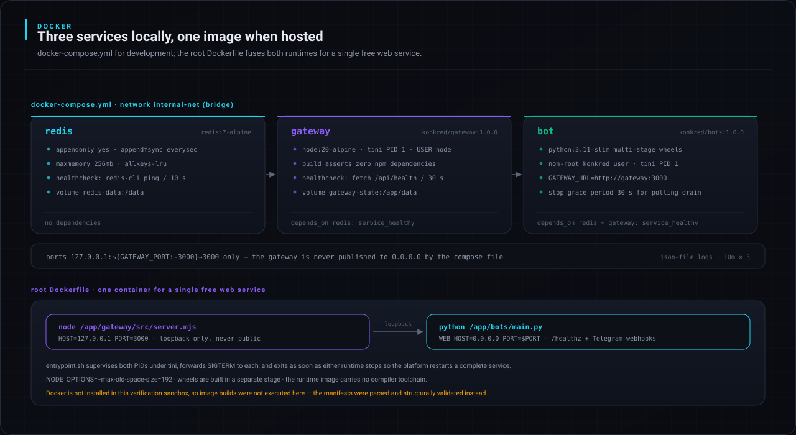

Compose runs three services on a private bridge network with real dependency ordering: `gateway`
waits for `redis-cli ping`, `bot` waits for `/api/health`. The gateway port is published to
`127.0.0.1` only. For hosting, the root `Dockerfile` fuses both runtimes into one container —
Node on loopback `:3000`, Python on `$PORT` — supervised by `entrypoint.sh` under `tini`.

## CI and testing

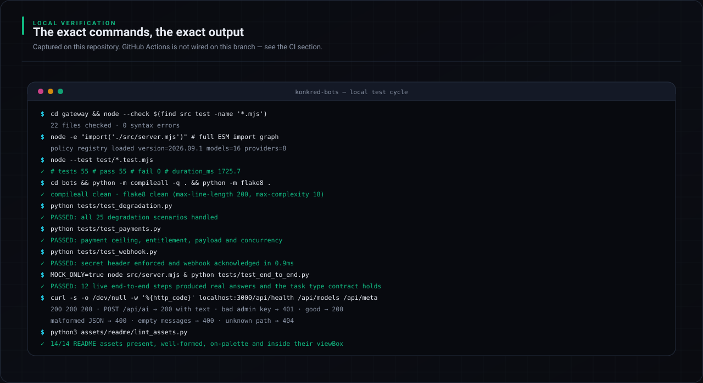

> [!WARNING]
> **GitHub Actions is not wired on this branch, and this README does not claim it is.** The
> four-job pipeline lives at [`ci/github-actions-ci.yml`](ci/github-actions-ci.yml); `.gitignore`
> excludes `.github/workflows/`, and a push installing it is rejected — *"refusing to allow a
> GitHub App to create or update workflow `.github/workflows/ci.yml` without `workflows`
> permission"*, re-verified on this branch. Every result below was produced **locally**.

Activate it from a clone that uses your own credentials — it needs no edits and no secrets,
because every job runs with `MOCK_ONLY=true`:

```bash
mkdir -p .github/workflows
git show HEAD:ci/github-actions-ci.yml > .github/workflows/ci.yml
git add -f .github/workflows/ci.yml        # .gitignore currently excludes the path
git commit -m "ci: activate the GitHub Actions pipeline" && git push
```

The local cycle, and what each command proves:

```bash
cd gateway
node --check $(find src test -name '*.mjs')      # 22 files parse
node -e "import('./src/server.mjs')"             # the whole ESM graph resolves
node --test test/*.test.mjs                      # 55 unit tests, registry integrity included

cd ../bots
python -m compileall -q . && python -m flake8 .
python tests/test_degradation.py                 # 25 gateway-failure scenarios
python tests/test_payments.py                    # ceiling, concurrency, signed payload
python tests/test_webhook.py                     # secret enforcement, fast acknowledgement

cd ../gateway && MOCK_ONLY=true node src/server.mjs &
cd ../bots && python tests/test_end_to_end.py    # 12 live steps over real HTTP

cd .. && python3 assets/readme/build_assets.py   # regenerate the 14 diagrams
python3 assets/readme/lint_assets.py             # palette, refs, viewBox, README paths
```

Results from the run that produced this README:

| Check | Result |
|---|---|
| Gateway syntax · ESM graph | 22 files, 0 errors · registry `2026.09.1`, 16 models, 8 providers |
| Gateway unit tests | **55 passed**, 0 failed, 1.73 s |
| Python compile · flake8 | clean · clean |
| Degradation | **25/25 scenarios handled** |
| Payments · webhook | ceiling, entitlement, payload, concurrency · secret enforced, 0.9 ms ack |
| End-to-end | **12 live steps**, task-type contract holds |
| HTTP smoke | 200 health/models/meta · 200 `/api/ai` · 401 bad admin key, 200 good · 400 malformed · 404 unknown |
| Manifests | compose `bot gateway redis` · render 1 web service · CI 4 jobs · `bash -n` clean |
| Assets | 14/14 present, on-palette, inside viewBox |

Docker is not installed in the sandbox that produced this run, so image builds were validated
structurally rather than executed.

## Deployment

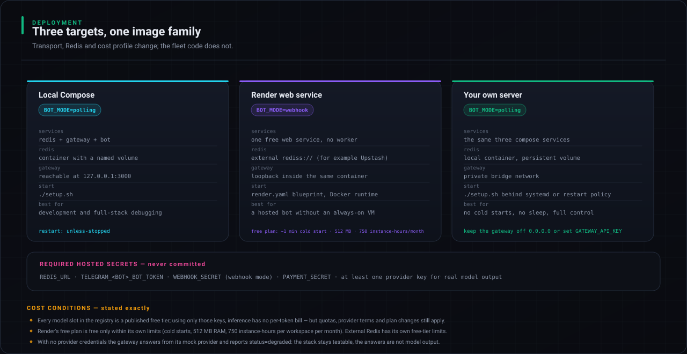

**Local Compose** — `./setup.sh`: three services, `restart: unless-stopped`, polling.

**Render, one free web service** — `render.yaml` creates exactly one `plan: free` web service and
no Render Redis. Attach an external Redis as `REDIS_URL`, add at least one `TELEGRAM_*_BOT_TOKEN`,
keep `BOT_MODE=webhook`, and let the blueprint generate `WEBHOOK_SECRET` and `PAYMENT_SECRET`.
Render injects `RENDER_EXTERNAL_URL` itself. Deploy, open `/healthz`, and the logs should show
each active bot followed by `webhook registered`.

**Your own server** — the same Compose stack behind a restart policy: no cold starts, no sleep.
Keep the gateway off `0.0.0.0`, or set `GATEWAY_API_KEY` if you must expose it.

### Cost conditions, stated exactly

- Every registry slot is a **published free tier**: with only those credentials there is no
  per-token bill, but provider quotas, terms and plan changes still apply, and the registry must
  be refreshed as vendors retire model ids.
- Render's free plan is free **within its own limits** — roughly one-minute cold starts, 512 MB
  RAM, 750 instance-hours per workspace per month, ephemeral disk. External Redis has its own.
- With no provider credentials the gateway answers from its mock provider and reports
  `status=degraded`: fully testable, but not model output.

Hosted secrets, never committed: `REDIS_URL`, one or more `TELEGRAM_*_BOT_TOKEN`,
`WEBHOOK_SECRET` (webhook mode), `PAYMENT_SECRET`, and a provider key such as `GEMINI_KEY_P1`.
`.env` is gitignored; only `.env.example` is committed and it holds no secret values.

## License

MIT.

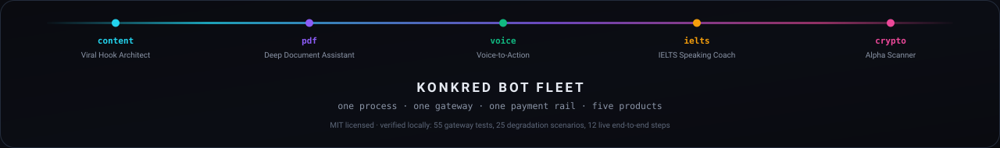
