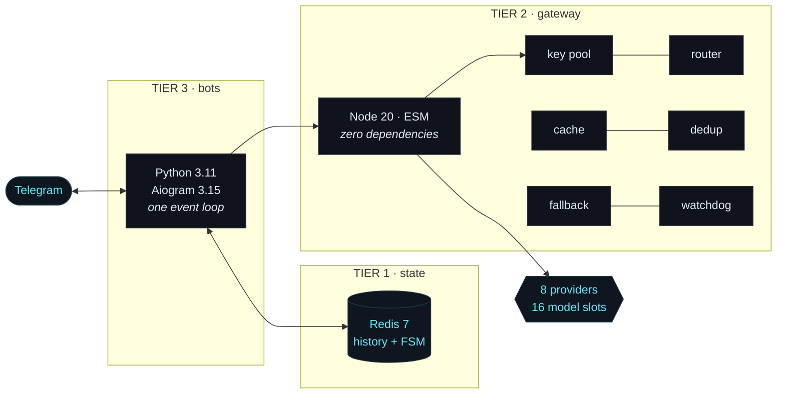

<div align="center">


# Konkred — Multi-Bot AI Ecosystem

**Five production Telegram bots, one Python process, zero inference spend.**

<br>

<a href="#quick-start"></a>
<a href="#architecture"></a>
<a href="#gateway-http-api"></a>
<a href="#deployment"></a>

<br><br>


<br>


</div>


Everything routes through a purpose-built **AI gateway** that pools free-tier
credentials across eight providers, tracks every published rate limit in real
time, and falls back across models when a key rate-limits, a provider stalls, or
a request exceeds a context window. The bots never speak to a model vendor
directly — they speak to the gateway, and the gateway decides who answers.

<div align="center">

</div>

<details markdown="1">
<summary><b>Plain-text architecture</b> — copy-paste friendly</summary>

<br>

```
Telegram ──► bots (Python 3.11 · Aiogram 3.15)     one process, five bots
                │
                ├──► redis     conversation memory + FSM state
                │
                └──► gateway (Node 20 · zero deps)
                          │  key pool · router · cache · dedup · fallback
                          ▼
              Gemini · Groq · Cerebras · Mistral · OpenRouter
              Cloudflare · GitHub Models · built-in mock
```

</details>

<table>
<tr>
<td width="33%" valign="top">

### ◈ Never a dead end

Eight task types, each with a ranked
candidate chain up to **12 models deep**,
every one ending in a local mock tail.
A chain physically cannot run out.

</td>
<td width="33%" valign="top">

### ⚡ Never over quota

Admission stops at **85% RPM**, 90% TPM,
95% RPD, 98% TPD of every published
ceiling — with timezone-aware daily
resets and self-calibrating watchdog.

</td>
<td width="33%" valign="top">

### ⬡ Never a blank reply

Empty completions raise typed errors.
`SAFETY`, `RECITATION`, `BLOCKLIST` and
`content_filter` each continue the chain
instead of handing back a blank message.

</td>
</tr>
</table>


## Table of contents

<table>
<tr>
<td valign="top" width="33%">

**Getting started**
- [The bots](#the-bots)
- [Quick start](#quick-start)
- [Local development](#local-development)
- [Testing](#testing)

</td>
<td valign="top" width="33%">

**How it works**
- [Architecture](#architecture)
  - [Tier 1 — Redis](#tier-1--redis)
  - [Tier 2 — The AI gateway](#tier-2--the-ai-gateway)
  - [Tier 3 — The bot daemon](#tier-3--the-bot-daemon)
- [Gateway HTTP API](#gateway-http-api)
- [Revenue gate](#revenue-gate)

</td>
<td valign="top" width="33%">

**Running it**
- [Configuration](#configuration)
- [Security model](#security-model)
- [Deployment](#deployment)
- [Operations](#operations)
- [Troubleshooting](#troubleshooting)
- [Repository layout](#repository-layout)

</td>
</tr>
</table>


## The bots

Each bot is an independently routed Aiogram `Router`, but they all run inside a
single asyncio process and share one HTTP pool and one Redis connection.

<table>
<tr>
<td width="86" align="center" valign="middle">

</td>
<td valign="top">

### 🎙 Voice-to-Action
<code>TELEGRAM_VOICE_BOT_TOKEN</code>

Send a voice note or audio file. Returns a cleaned transcription, a structured summary, and an `[ACTION]` / `[DECISION]` / `[QUESTION]` list with owners and deadlines. Audio is streamed to memory and never written to disk.

`/start` &nbsp;`/help` &nbsp;`/clear` &nbsp;`/paysupport`

</td>
</tr>
<tr>
<td width="86" align="center" valign="middle">

</td>
<td valign="top">

### 📄 Deep Document Assistant
<code>TELEGRAM_PDF_BOT_TOKEN</code>

Send a PDF, TXT, MD or DOCX. Inline buttons produce an executive summary, a validated 5-question quiz with answer callbacks, flashcards, or a contract-risk analysis.

`/start` &nbsp;`/help` &nbsp;`/clear` &nbsp;`/paysupport`

</td>
</tr>
<tr>
<td width="86" align="center" valign="middle">

</td>
<td valign="top">

### 🎓 IELTS Speaking Coach
<code>TELEGRAM_IELTS_BOT_TOKEN</code>

A full three-part mock interview driven by an FSM. Scores all four official criteria — Fluency &amp; Coherence, Lexical Resource, Grammatical Range &amp; Accuracy, Pronunciation — and returns a band from 1.0 to 9.0.

`/test` &nbsp;`/bands` &nbsp;`/stop` &nbsp;`/help` &nbsp;`/clear` &nbsp;`/paysupport`

</td>
</tr>
<tr>
<td width="86" align="center" valign="middle">

</td>
<td valign="top">

### 🎬 Viral Hook Architect
<code>TELEGRAM_CONTENT_BOT_TOKEN</code>

Pick a topic, a platform (Reels / TikTok / Shorts) and a tone. Returns three scroll-stopping hooks, a beat-by-beat 30-second script with timestamps, and an SEO caption with hashtags.

`/create` &nbsp;`/formulas` &nbsp;`/cancel` &nbsp;`/help` &nbsp;`/clear` &nbsp;`/paysupport`

</td>
</tr>
<tr>
<td width="86" align="center" valign="middle">

</td>
<td valign="top">

### 📊 Alpha Scanner
<code>TELEGRAM_CRYPTO_BOT_TOKEN</code>

Market sentiment scored 1–100 with the drivers behind it, whale-activity notes and an explicit risk warning. Multi-model fusion is enabled for scans. Every reply carries a *not financial advice* disclaimer.

`/scan <ticker>` &nbsp;`/sentiment <topic>` &nbsp;`/news` &nbsp;`/help` &nbsp;`/clear` &nbsp;`/paysupport`

</td>
</tr>
</table>

<details markdown="1">
<summary><b>The same five bots as a plain table</b></summary>

<br>

| Bot | Token variable | What it does | Commands |
|---|---|---|---|
| 🎙 **Voice-to-Action** | `TELEGRAM_VOICE_BOT_TOKEN` | Send a voice note or audio file. Returns a cleaned transcription, a structured summary, and an `[ACTION]` / `[DECISION]` / `[QUESTION]` list with owners and deadlines. Audio is streamed to memory and never written to disk. | `/start` `/help` `/clear` `/paysupport` |
| 📄 **Deep Document Assistant** | `TELEGRAM_PDF_BOT_TOKEN` | Send a PDF, TXT, MD or DOCX. Inline buttons produce an executive summary, a validated 5-question quiz with answer callbacks, flashcards, or a contract-risk analysis. | `/start` `/help` `/clear` `/paysupport` |
| 🎓 **IELTS Speaking Coach** | `TELEGRAM_IELTS_BOT_TOKEN` | A full three-part mock interview driven by an FSM. Scores all four official criteria — Fluency & Coherence, Lexical Resource, Grammatical Range & Accuracy, Pronunciation — and returns a band from 1.0 to 9.0. | `/test` `/bands` `/stop` `/help` `/clear` `/paysupport` |
| 🎬 **Viral Hook Architect** | `TELEGRAM_CONTENT_BOT_TOKEN` | Pick a topic, a platform (Reels / TikTok / Shorts) and a tone. Returns three scroll-stopping hooks, a beat-by-beat 30-second script with timestamps, and an SEO caption with hashtags. | `/create` `/formulas` `/cancel` `/help` `/clear` `/paysupport` |
| 📊 **Alpha Scanner** | `TELEGRAM_CRYPTO_BOT_TOKEN` | Market sentiment scored 1–100 with the drivers behind it, whale-activity notes and an explicit risk warning. Multi-model fusion is enabled for scans. Every reply carries a *not financial advice* disclaimer. | `/scan <ticker>` `/sentiment <topic>` `/news` `/help` `/clear` `/paysupport` |

</details>

> [!TIP]
> **Set only the tokens you want.** `get_active_bots()` filters on a non-empty
> token, so a bot with no token simply never starts — no errors, no placeholder
> process.


## Quick start

### Prerequisites

- Docker with the Compose plugin (`docker compose version`)
- At least one Telegram bot token from [@BotFather](https://t.me/BotFather)
- Optionally one or more free AI provider keys — without any, the gateway serves
  deterministic mock responses so you can still exercise the whole stack

### Five steps

```bash
# 1. Clone
git clone https://github.com/reARbitRA/konkred-bots.git
cd konkred-bots

# 2. Create your env file (this also happens automatically on first run)
cp .env.example .env

# 3. Add at least one bot token and ideally one provider key
#    TELEGRAM_VOICE_BOT_TOKEN=123456:ABC-DEF...
#    GEMINI_KEY_P1=AIza...
$EDITOR .env

# 4. Build and start everything
./setup.sh

# 5. Open Telegram and send /start to your bot
```

`setup.sh` verifies Docker is running, creates `.env` from the template if it is
missing, reports which bots are configured and which will stay offline, warns
when no provider keys are present, validates the compose file, builds, starts,
and waits for the gateway to report healthy.

```bash
./setup.sh            # build + start + health report
./setup.sh --logs     # ...then follow logs
./setup.sh --status   # health only, no rebuild
./setup.sh --down     # stop the stack
```

### Verify it is up

```bash
curl localhost:3000/api/health     # status, ready slots, cache stats
curl localhost:3000/api/models     # 16 model slots, 8 task types
docker compose logs -f bot         # watch the bots poll Telegram
```

> [!NOTE]
> A `degraded` health status is normal and expected when you have not supplied any
> real provider credentials: it means the pool is alive but only the mock provider
> is ready. The service only returns `503` when the pool is genuinely empty.


## Architecture

Three services on a private bridge network, started in dependency order with
real healthchecks — `gateway` waits for `redis` to pass `redis-cli ping`, and
`bot` waits for the gateway's `/api/health` to pass.



### Tier 1 — Redis

`redis:7-alpine`, append-only persistence with `everysec` fsync, capped at 256 MB
with an `allkeys-lru` eviction policy, and a named volume so state survives
restarts. It holds two things:

**Conversation memory** — `HistoryManager` keeps a sliding window of the last 10
turns per user per bot, JSON-encoded with a 24-hour TTL:

```
konkred:hist:{bot}:{user_id}
```

**FSM state** — Aiogram's `RedisStorage` with a `DefaultKeyBuilder` whose prefix
is namespaced per bot and which includes the bot id:

```
konkred:fsm:{bot}:{bot_id}:{chat_id}:{user_id}:data
```

Both namespaces are verified isolated by tests: identical user ids in different
bots never see each other's history or state.

### Tier 2 — The AI gateway

Node.js 20, ESM, **zero runtime dependencies** — native `node:http`, no Express,
no SDKs. Roughly 5,000 lines across eight focused modules.

<div align="center">

</div>

#### Quota registry

`gateway/data/policies.registry.json` (version `2026.09.1`) encodes the published
free-tier limits of **16 model slots across 8 providers**:

| Provider | Models |
|---|---|
| Gemini | `flash`, `flash-lite` |
| Groq | `gpt-oss-120b`, `gpt-oss-20b`, `qwen3-27b` |
| Cerebras | `gpt-oss-120b`, `llama-8b`, `qwen3-235b` |
| Mistral | `small`, `codestral` |
| OpenRouter | `free-auto` — their auto-router over whatever is free today |
| Cloudflare | `llama-8b` |
| GitHub Models | `gpt-4o`, `gpt-4o-mini` |
| Mock | `general`, `fast` |

Every entry declares RPM, TPM, RPD and TPD, a context window, and capability
flags (multimodal, JSON mode, tool use). CI validates the registry on every push:
no duplicate keys, no missing fields, no references to unknown providers, and —
importantly — no task route pointing at a model the registry no longer contains.

> [!IMPORTANT]
> **Model ids drift.** Providers retire model names on a rolling schedule (Groq
> alone retired five of the ids this registry originally shipped with). The
> gateway is built to survive that: an upstream that answers "this model has
> been decommissioned" is classified `model_unavailable`, the model is benched
> for 24h, and the request **transparently continues to the next candidate**
> rather than failing. The log line tells you which entry to update. Refresh the
> registry against each provider's docs every few months.

#### Key pool

One **slot** per `(provider, model, credential)` triple. Each slot maintains a
60-second sliding `minuteLog` and a 30-day `monthLog`, and resets daily counters
on a timezone-aware boundary — **midnight Pacific for Gemini**, UTC for everyone
else, because that is what the vendors actually do.

Admission uses deliberate **headroom** rather than the raw published limit, so
clock skew and concurrent instances cannot push you over:

<div align="center">

</div>

| Window | Headroom |
|---|---|
| RPM | 85% |
| TPM | 90% |
| RPD | 95% |
| TPD | 98% |

On a `429` the slot enters exponential backoff — `base · 2^(errors−1)` with
±10% jitter — and the pool moves on without waiting.

#### Router

Eight task types map to ranked candidate chains:

```
general · code-generation · spec-generation · summarization
classification · bug-fixing · architecture · translate
```

<div align="center">

</div>

<sub>Regenerate this chart straight from the router with
<code>node assets/readme/build-route-chart.mjs</code> — it reads <code>TASK_ROUTES</code>, so the
diagram can never drift from the code.</sub>

Requests are sized in tokens (≈3.6 chars/token) and **context windows are
validated before a slot is assigned**, so a request too large for a model is
never dispatched to it.

#### Fallback engine

Every failure is classified, and each class has a distinct recovery:

<div align="center">

</div>

| Error class | Action |
|---|---|
| `rate_limit` | cool the slot down, try the next candidate |
| `auth` | disable the slot for the process lifetime |
| `context_length` | raise the context requirement and re-plan |
| `safety_block` | bench that specific model for 5 minutes |
| `model_unavailable` | retired/unknown model id — bench it for 24h, keep the credential healthy |
| `server` / `timeout` | bench the whole provider, with strikes |
| `bad_request` | abort — the request itself is malformed, so retrying wastes quota |

Empty completions are not silently returned: a response with a `SAFETY`,
`RECITATION`, `BLOCKLIST` or `content_filter` finish reason raises a typed error
so the chain continues to the next candidate instead of handing the user a blank
message.

#### Cache and dedup

The **cache** keys on a SHA-256 of `{taskType, messages, model, temperature,
maxTokens, privacy}` — an LRU of 500 entries with a 600-second TTL. Requests
marked `privacy` are never cached.

**In-flight deduplication** collapses identical concurrent requests into one
upstream call via a `Map<string, {startedAt, promise, timer}>` with a hard
180-second TTL. The eviction timers are `unref()`ed so they never hold the event
loop open.

#### Watchdog

Every 60 seconds the watchdog rolls sliding windows forward, releases expired
cooldowns, and **self-calibrates**: when a provider returns a `429` earlier than
the registry predicted, the observed ceiling is recorded and respected from then
on. State is persisted to `gateway/data/runtime.state.json` so daily counters
survive a restart.

### Tier 3 — The bot daemon

One Python process, one `asyncio` event loop. `main.py` opens a single
`redis.asyncio.Redis`, builds one `Bot` + `Dispatcher` per configured token, and
attaches that bot's router, namespaced `HistoryManager`, and `PaymentManager`
through dispatcher DI.

The transport is selected with `BOT_MODE`:

- **`webhook`** — aiohttp receives Telegram POSTs at a secret per-bot route,
  validates Telegram's secret header, schedules dispatch in the background, and
  returns `200 OK` immediately. This is the Render mode.
- **`polling`** — every dispatcher long-polls Telegram concurrently. aiohttp
  still serves `/healthz` for local Compose or a paid always-on container host.

Shared infrastructure lives in `bots/shared/`:

- **`config.py`** — loads `.env`, exposes typed settings and `BOT_SPECS`, and
  `get_active_bots()` returns only bots whose token is actually set
- **`gateway_client.py`** — a singleton `httpx.AsyncClient`
  (`max_keepalive_connections=20`, 120 s timeout) with a typed `GatewayError`
  carrying `status_code`, `code`, `message` and `retry_after`. It retries only
  what is worth retrying — `502`/`504` and the codes `all_candidates_failed`,
  `all_slots_rate_limited`, `internal_error` — with capped backoff
  `min(4.0, 0.75 · 2^attempt)`
- **`history.py`** — the Redis sliding-window memory described above
- **`payments.py`** — atomic free-use counters, signed Stars invoices,
  auto-unlock on payment, and optional admin-approved USDT verification
- **`utils.py`** — `split_telegram_message()` respects Telegram's 4096-character
  ceiling, splitting on paragraph breaks first, then line breaks, then spaces,
  and only hard-slicing a genuinely unbreakable run of characters

Shutdown is graceful and single-owner: one `SIGINT`/`SIGTERM` handler stops
pollers or drains in-flight webhook tasks, closes Telegram and gateway HTTP
sessions, and releases the Redis pool.


## Gateway HTTP API

| Method | Path | Purpose |
|---|---|---|
| `POST` | `/api/ai` | Run a completion |
| `GET` | `/api/health` | Liveness, ready slots, cache stats |
| `GET` | `/api/models` | Every model slot and task type |
| `GET` | `/api/meta` | Registry version, provider summary, config |
| `GET` | `/api/admin/dashboard` | HTML ops dashboard (`x-admin-key`) |
| `GET` | `/api/admin/stats` | JSON slot telemetry (`x-admin-key`) |
| `POST` | `/api/admin/reset` | Clear caches, benches, cooldowns (`x-admin-key`) |

### Request

```jsonc
{
  "taskType": "summarization",     // or task_type / task
  "messages": [{ "role": "user", "content": "..." }],
  "system": "optional system prompt",
  "temperature": 0.3,              // 0–2
  "maxTokens": 2048,               // 1–65536
  "model": "groq:llama-70b",       // optional pin
  "jsonMode": false,
  "stopSequences": [],             // up to 4
  "privacy": false,                // true disables caching
  "noCache": false,
  "fusion": false,                 // multi-model consensus
  "userId": "telegram:12345"       // fair-use accounting
}
```

Limits: 60 messages and 2,000,000 characters per request.

### Success

```jsonc
{
  "requestId": "S6VJzPfSh6jd",
  "text": "...",
  "task": "summarization",
  "model": "groq:llama-70b",
  "provider": "groq",
  "upstreamModel": "llama-3.3-70b-versatile",
  "finishReason": "stop",
  "usage": { "promptTokens": 412, "completionTokens": 260, "totalTokens": 672 },
  "attempts": [ /* every slot tried, with outcome and latency */ ],
  "fusion": { "enabled": false },
  "cached": false,
  "latencyMs": 842
}
```

Also returned as headers: `x-request-id`, `x-model`, `x-provider`, `x-cache`.

### Errors

Always shaped `{"error": {"code", "message", ...}}`:

| Status | Codes |
|---|---|
| `400` | `invalid_request`, `invalid_json` |
| `401` | `unauthorized` |
| `413` | `payload_too_large` |
| `429` | `user_rpm`, `user_rpd`, `user_tpd` |
| `429` / `503` | `all_slots_rate_limited`, `all_candidates_failed` |
| `500` | `internal_error` |


## Revenue gate

<div align="center">

</div>

The first **5 AI-powered actions per user, per bot** are free. Navigation and
setup actions (`/start`, help, uploading a document, choosing a platform, quiz
answer buttons) do not consume the allowance. Redis `WATCH`/`MULTI` makes the
counter atomic, so concurrent requests cannot cross the ceiling.

Request 6 sends a native **Telegram Stars (`XTR`) invoice**. The default offer is
100 Stars for a 30-day pass; Telegram's `pre_checkout_query` is validated against
a signed, user-bound payload, and `successful_payment` writes the entitlement to
Redis immediately. No external payment provider token is needed for Stars used
to sell digital bot access.

> [!CAUTION]
> An optional **USDT fallback** exists behind `USDT_WALLET_ADDRESS`, with manual
> admin verification. Keep it **disabled for in-Telegram digital access** unless
> you have obtained platform/legal guidance: Telegram's current terms require
> digital goods and services sold inside bots to use Stars. Showing a wallet
> address also cannot safely prove an on-chain payment by itself. The default
> Render configuration leaves the address blank, so the compliant deployment
> path is Stars only.

All pricing and limits are environment settings, so they can be changed without
a rebuild. Setting `PAYMENTS_ENABLED=false` disables the gate.


## Configuration

Everything is environment-driven; `.env.example` documents every variable with
links to where each credential is issued. Highlights:

| Variable | Default | Purpose |
|---|---|---|
| `TELEGRAM_*_BOT_TOKEN` | — | One per bot; empty means that bot stays offline |
| `GEMINI_KEY_P1/P2/P3` | — | Up to three pooled Gemini keys for 3× daily quota |
| `GROQ_API_KEY`, `CEREBRAS_API_KEY`, `MISTRAL_API_KEY`, `OPENROUTER_API_KEY`, `GITHUB_TOKEN` | — | Optional providers; more keys means deeper fallback |
| `CF_ACCOUNT_ID` + `CF_API_TOKEN` | — | Both required to enable Cloudflare Workers AI |
| `ADMIN_KEY` | — | Unlocks `/api/admin/*`; unset disables the admin surface |
| `GATEWAY_API_KEY` | — | Bearer token the bots present to the gateway |
| `BOT_MODE` | `polling` | `polling` or `webhook` transport |
| `WEBHOOK_HOST` / `WEBHOOK_SECRET` | — | Public HTTPS origin and Telegram webhook secret; Render origin is auto-detected |
| `REDIS_URL` | `redis://127.0.0.1:6379/0` | Redis URL; use an external `rediss://` URL when hosted |
| `FREE_REQUESTS` | `5` | Free AI actions per user per bot |
| `STARS_PRICE` / `PAID_ACCESS_DAYS` | `100` / `30` | Stars pass price and lifetime |
| `USDT_WALLET_ADDRESS` / `PAYMENT_ADMIN_IDS` | — | Optional manual USDT verification path |
| `CACHE_TTL_SECONDS` / `CACHE_MAX_ENTRIES` | `600` / `500` | Response cache |
| `DEDUP_TTL_MS` | `180000` | In-flight dedup hard TTL |
| `HEADROOM_RPM/TPM/RPD/TPD` | `0.85/0.90/0.95/0.98` | Quota safety margin |
| `USER_RPM` / `USER_RPD` / `USER_TPD` | `12` / `400` / `900000` | Per-user fair use |
| `ALLOW_MOCK` / `MOCK_ONLY` | `true` / `false` | Mock fallback; offline mode |
| `HISTORY_TURNS` / `HISTORY_TTL` | `10` / `86400` | Conversation memory |

> [!TIP]
> **Gemini is the only provider with native audio and PDF understanding.** The
> voice and document bots produce their best results with at least one
> `GEMINI_KEY_*` configured.


## Security model

<table>
<tr><td width="50%" valign="top">

**🔑 Secrets never reach the repository.** `.env` is gitignored, only
`.env.example` — which contains no secret values — is committed. The Render
manifest references secrets with `sync: false` or generates them, so nothing
sensitive lives in version control. Bot tokens are never placed in webhook URLs:
the path contains an HMAC-derived value and Telegram must also send the
`X-Telegram-Bot-Api-Secret-Token` header. Render's generated base64 secret is
hashed to Telegram-safe hexadecimal before it is registered or compared.

</td><td width="50%" valign="top">

**⏱ Admin authentication is timing-safe.** The `x-admin-key` header is compared
with `crypto.timingSafeEqual` over equal-length buffers, which does not leak the
key through response timing. If `ADMIN_KEY` is unset, the entire `/api/admin/*`
surface is disabled rather than left open.

</td></tr>
<tr><td width="50%" valign="top">

**🛡 The gateway is not meant to be public.** In Compose it lives on a private
bridge network. In the unified image Node binds only to `127.0.0.1:3000`; only
the Python health/webhook server binds the platform's public `$PORT`. If you do
expose the gateway separately, set `GATEWAY_API_KEY`.

</td><td width="50%" valign="top">

**⚖ Per-user fair use** is enforced inside the gateway on RPM, RPD and TPD, keyed
by Telegram user id, so one user cannot exhaust a shared free-tier quota. Tiers
and per-user overrides are configurable through `USERS_JSON`.

</td></tr>
<tr><td width="50%" valign="top">

**👤 Containers run unprivileged.** The gateway runs as `node`, the bots as a
dedicated `konkred` user. Both use `tini` as PID 1 so `SIGTERM` reaches the
application and shutdown is graceful rather than a 10-second kill.

</td><td width="50%" valign="top">

**📦 Input is bounded everywhere.** Requests are capped at 60 messages and
2,000,000 characters; uploads are capped by `MAX_FILE_MB` (Telegram's own ceiling
is 20 MB); audio and documents are processed in memory and never persisted.
Privacy-marked requests bypass the cache entirely.

</td></tr>
<tr><td width="50%" valign="top">

**🧪 Output is treated as untrusted.** Model output is HTML-escaped before being
sent to Telegram, and structured output (such as generated quizzes) is validated
field by field — option counts, answer indices and types are all checked before
anything is rendered into a keyboard.

</td><td width="50%" valign="top">

> [!WARNING]
> On a public VPS, do not publish the gateway port to `0.0.0.0`. When
> `GATEWAY_API_KEY` is empty the gateway accepts unauthenticated `/api/ai`
> calls by design — safe on a private compose network, an open proxy on the
> open internet. `docker-compose.yml` binds to `127.0.0.1` for this reason.

</td></tr>
</table>


## Local development

Run the two tiers directly, without Docker.

```bash
# Terminal 1 — gateway (no credentials needed in mock mode)
cd gateway
MOCK_ONLY=true ADMIN_KEY=dev-key node src/server.mjs

# Terminal 2 — bots
cd bots
pip install -r requirements.txt
GATEWAY_URL=http://127.0.0.1:3000 REDIS_URL=redis://localhost:6379/0 python main.py
```

`MOCK_ONLY=true` makes the gateway answer entirely from its deterministic mock
provider — no outbound network calls at all, which is exactly what CI uses.


## Testing

```bash
# Gateway — 55 tests, ~1.9s
cd gateway && node --test test/*.test.mjs

# Bots — compile + lint
cd bots && python -m compileall -q . && python -m flake8 .

# Bots — graceful degradation when the gateway cannot answer (25 scenarios)
cd bots && python tests/test_degradation.py

# Revenue gate — ceiling, concurrency, signed payload and paid entitlement
cd bots && python tests/test_payments.py

# Webhook — secret authentication and sub-200 ms acknowledgement
cd bots && python tests/test_webhook.py

# Bots — live end-to-end against a real gateway (no credentials needed)
cd gateway && MOCK_ONLY=true node src/server.mjs &
cd bots && python tests/test_end_to_end.py

# README assets — colours, dangling gradient refs, viewBox overflow
python3 assets/readme/lint-svg.py
```

> [!IMPORTANT]
> **Activating CI:** the pipeline lives at `ci/github-actions-ci.yml` rather
> than `.github/workflows/ci.yml`, because the GitHub App used to push this
> branch lacks the `workflows` permission. Move it into place with
> `git mv ci/github-actions-ci.yml .github/workflows/ci.yml` — no edits needed.
> See [`ci/README.md`](ci/README.md).

CI runs four jobs on every push and pull request:

<div align="center">

</div>

| Job | What it proves |
|---|---|
| **gateway** | registry is valid, every routed model still exists in it, every `.mjs` parses, the full import graph resolves, 51 unit tests pass, and a live server answers health/models/meta/inference, rejects a bad admin key with `401`, accepts the real one with `200`, and rejects a malformed body with `400` |
| **bots** | every module byte-compiles, flake8 is clean, routers and command menus line up with `BOT_SPECS` and every router has handlers, the message splitter holds its invariants over 300 randomised cases, all five bots degrade gracefully across 25 gateway-failure scenarios, every bot flow produces a real answer against a live gateway over real HTTP, every `task_type` the bots send is one the gateway actually supports, and history + FSM namespaces are proven isolated on fakeredis |
| **integration** | the real `GatewayClient` drives a real gateway over HTTP across every task route the bots use, including multimodal audio parts and JSON mode, and the rate limiter produces a correctly typed, user-presentable error |
| **compose** | `docker compose config` validates, the local service list is exactly `bot gateway redis`, every YAML manifest parses, all build contexts exclude secrets/caches, the unified hosted image builds, the gateway stays dependency-free, and both shell entrypoints pass `bash -n` plus shellcheck |


## Deployment

### Local Docker Compose

Compose remains the best local-development path and still runs Redis, gateway
and bots as separate services:

```bash
./setup.sh
```

### Render — one free web service

The root `Dockerfile` combines Node and Python in one container. Node listens
privately on loopback port 3000; Python listens on Render's dynamic `$PORT` and
handles `/healthz` plus Telegram webhooks. `render.yaml` contains exactly one
`plan: free` web service—no worker and no Render Redis instance.

1. Create a free Redis database (for example Upstash) and copy its TLS
   `rediss://default:...` connection URL.
2. In Render choose **New → Web Service**, connect this repository, select
   **Docker**, root directory `.` and the **Free** instance type. You can also
   apply `render.yaml`; it now creates only the single free web service.
3. Add `REDIS_URL` and at least one `TELEGRAM_*_BOT_TOKEN`.
4. Keep `BOT_MODE=webhook`. Render automatically supplies
   `RENDER_EXTERNAL_URL`; set `WEBHOOK_HOST=https://your-service.onrender.com`
   manually only if that automatic value is unavailable.
5. Generate `WEBHOOK_SECRET` and `PAYMENT_SECRET` with
   `openssl rand -hex 32` (the blueprint generates both automatically).
6. Keep `FREE_REQUESTS=5`; choose your `STARS_PRICE` and
   `PAID_ACCESS_DAYS`. For USDT, also set `USDT_WALLET_ADDRESS`,
   `PAYMENT_ADMIN_IDS` and `PAYMENT_SUPPORT`.
7. Add at least one free AI provider key for real model output. OpenRouter's
   free router covers every text task without a payment method; native voice
   transcription still needs a multimedia-capable key such as Gemini. With no
   provider key, `ALLOW_MOCK=true` keeps the service testable but produces mock
   answers.
8. Deploy and open `https://your-service.onrender.com/healthz`. Logs should show
   each active bot followed by `webhook registered`.

`DROP_PENDING_UPDATES=false` is intentional in webhook mode: an update that
wakes a sleeping service must not be discarded during startup. Telegram retries
an unsuccessful webhook while the free instance starts.

**Free-tier limits:** Render documents roughly one-minute cold starts, 512 MB RAM,
750 instance-hours per workspace/month, ephemeral local storage, and possible
suspension for unusually high outbound traffic. The hosted profile caps Node's
heap, cache entries, and upload size accordingly, and all durable state stays in
Redis. A Stars invoice should be paid while the bot is awake; if an old invoice
fails pre-checkout after a long idle period, send the request again to wake the
bot and issue a fresh invoice. Render explicitly positions Free instances for
hobby/testing rather than production SLAs.

### Hugging Face Docker Space — supported, but no longer a zero-card path

The root image remains compatible with Docker Spaces (`BOT_MODE=polling`,
`PORT=7860`), but Hugging Face now requires a PRO, Team, or Enterprise plan to
create a new compute-backed Docker Space. CPU Basic has no hourly compute charge
once available, yet account access itself is paid and free hardware can sleep.
It therefore does **not** meet this project's zero-credit-card deployment goal.
Use Render webhook mode for the genuinely free hosted path.

### Your own server over SSH

If you have a VPS or an always-free cloud VM, Compose is the most durable option:
all three services, `restart: unless-stopped`, no cold starts and no sleep. A
step-by-step runbook — Docker install, `.env`, `setup.sh`, reboot persistence,
SSH-tunnel dashboard access and low-RAM tuning — is in
[`docs/deploy-vps-fa.md`](docs/deploy-vps-fa.md) (Persian). Background on which
free tiers still exist in 2026 is in
[`docs/free-hosting-2026.md`](docs/free-hosting-2026.md).

### Required hosted secrets

Never commit these values:

```text
REDIS_URL=rediss://...
TELEGRAM_<BOT>_BOT_TOKEN=...
WEBHOOK_SECRET=...             # Render only
PAYMENT_SECRET=...
GEMINI_KEY_P1=...              # or another provider key
```


## Operations

```bash
docker compose logs -f bot          # bot activity
docker compose logs -f gateway      # routing decisions, fallbacks, quota events
docker compose restart gateway      # reload after changing provider keys
```

The gateway logs one JSON object per line — request id, task, chosen slot,
attempt chain, latency — so it drops straight into any log aggregator.

With `ADMIN_KEY` set, the HTML dashboard at `/api/admin/dashboard` shows live
slot health, per-window quota consumption, cooldowns, benched providers, cache
hit rate and dedup savings:

```bash
curl -H "x-admin-key: $ADMIN_KEY" localhost:3000/api/admin/dashboard
curl -H "x-admin-key: $ADMIN_KEY" localhost:3000/api/admin/stats | jq
```


## Troubleshooting

| Symptom | Cause and fix |
|---|---|
| Health reports `degraded` | Only the mock provider is ready. Add a real provider key and restart the gateway. |
| Bot does not respond | Confirm its token is set. In webhook mode, check logs for `webhook registered`, ensure `WEBHOOK_HOST` is HTTPS, and keep `DROP_PENDING_UPDATES=false`. |
| Service exits with a webhook configuration error | Set `WEBHOOK_SECRET` to at least 16 safe characters and provide `WEBHOOK_HOST`, or let Render inject `RENDER_EXTERNAL_URL`. |
| Request 6 does not show an invoice | Check `PAYMENTS_ENABLED=true`, `STARS_PRICE` is a positive integer, and inspect Telegram API errors in logs. |
| Stars paid but access stayed locked | Confirm Redis is reachable and `PAYMENT_SECRET` did not change between invoice creation and payment. Use `PAYMENT_SUPPORT` for receipts. |
| USDT admin receives no approval request | Set numeric `PAYMENT_ADMIN_IDS`; each admin must first open the bot so Telegram permits it to message them. |
| Every reply looks like a mock | No provider credentials were loaded, or `MOCK_ONLY=true` is still set. |
| `all_slots_rate_limited` | Free-tier quota is exhausted for this task. Add another provider key, or wait for the daily reset (midnight Pacific for Gemini, UTC elsewhere). |
| `429 user_rpm` | Per-user fair use, not a provider limit. Raise `USER_RPM` or grant that user a tier in `USERS_JSON`. |
| Audio or PDF results are weak | Add a `GEMINI_KEY_*`; Gemini is the only configured provider with native audio and PDF understanding. |
| `/api/admin/*` returns 401 | `ADMIN_KEY` is unset (surface disabled) or the `x-admin-key` header does not match. |


## Repository layout

```
konkred-bots/
├── Dockerfile                  unified Node + Python hosted image
├── entrypoint.sh               supervises both runtimes and forwards signals
├── render.yaml                 one free webhook web service
├── docker-compose.yml          local three-tier development stack
├── setup.sh                    one-command local bootstrap
├── .env.example                every variable, documented
├── ci/github-actions-ci.yml    gateway · bots · integration · manifests
│
├── assets/readme/              animated SVG diagrams used by this README
│   ├── build-route-chart.mjs   regenerates chart-routes.svg from TASK_ROUTES
│   └── lint-svg.py             colour / reference / viewBox linter
│
├── gateway/                    Node 20 · ESM · zero dependencies
│   ├── Dockerfile              node:20-alpine, non-root, HEALTHCHECK
│   ├── .dockerignore           keeps secrets, tests and caches out of the image
│   ├── data/
│   │   └── policies.registry.json   16 model slots across 8 providers
│   ├── src/
│   │   ├── server.mjs          native node:http routing
│   │   ├── config.mjs          env loading, credential discovery
│   │   ├── policy-store.mjs    registry loading and validation
│   │   ├── watchdog.mjs        window rolling, self-calibration
│   │   ├── dashboard.mjs       HTML ops dashboard
│   │   ├── util.mjs            logging, JSON, token estimation
│   │   ├── providers/          gemini · openai-compat · cloudflare · mock
│   │   └── gateway/            cache · dedup · key-pool · router
│   │                           fallback · user-limiter · fusion
│   └── test/                   gateway.test.mjs (51) + env-contract.test.mjs (4)
│
└── bots/                       Python 3.11 · Aiogram 3.15
    ├── Dockerfile              multi-stage, non-root, tini
    ├── .dockerignore           keeps secrets and __pycache__ out of the image
    ├── main.py                 orchestrator: N bots, one event loop
    ├── requirements.txt
    ├── shared/                 config · gateway_client · history · payments · utils
    ├── tests/                  degradation (25 scenarios) + live end-to-end suites
    ├── bot_voice/              transcription, summary, action items
    ├── bot_pdf/                summary, quiz, flashcards, risk analysis
    ├── bot_ielts/              three-part FSM mock interview
    ├── bot_content/            hooks, scripts, SEO captions
    └── bot_crypto/             sentiment, drivers, risk
```


## License

MIT

<div align="center">
<br>
<sub>Built to stay inside every free tier — and to keep answering when one of them says no.</sub>
<br><br>

</div>
